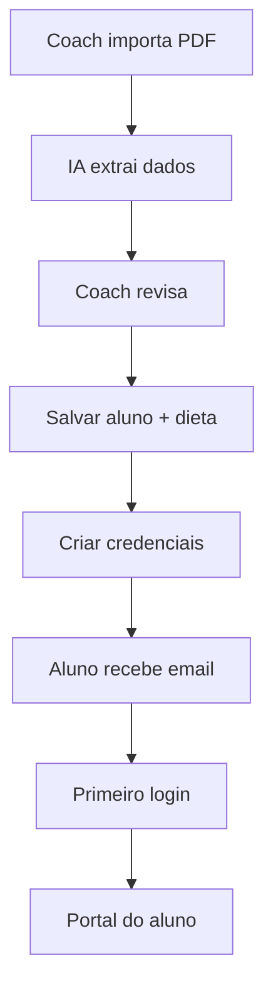
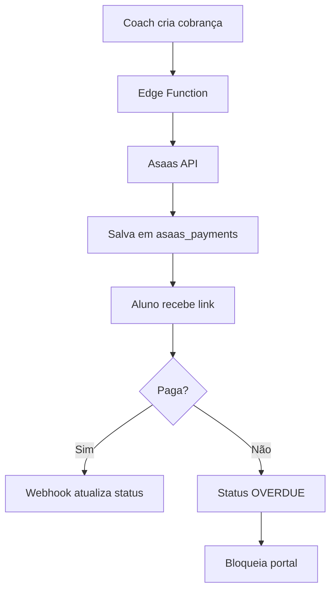
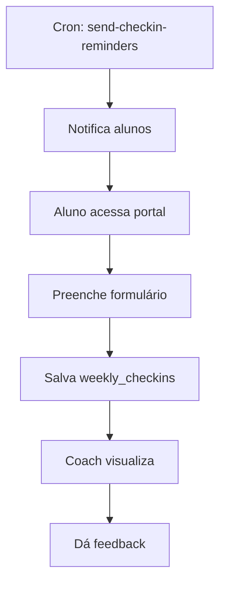

# 📚 Documentação Técnica Completa - Black House Coach Platform

**Versão:** 1.0  
**Data:** Janeiro 2025  
**Autor:** Equipe de Desenvolvimento  

---

## 📋 Índice

1. [Visão Geral do Sistema](#1-visão-geral-do-sistema)
2. [Arquitetura Técnica](#2-arquitetura-técnica)
3. [Stack Tecnológico](#3-stack-tecnológico)
4. [Estrutura de Arquivos](#4-estrutura-de-arquivos)
5. [Módulos e Funcionalidades](#5-módulos-e-funcionalidades)
6. [Banco de Dados](#6-banco-de-dados)
7. [Edge Functions (Backend)](#7-edge-functions-backend)
8. [Autenticação e Autorização](#8-autenticação-e-autorização)
9. [Regras de Negócio](#9-regras-de-negócio)
10. [Integrações Externas](#10-integrações-externas)
11. [Fluxos Críticos](#11-fluxos-críticos)
12. [Padrões de Código](#12-padrões-de-código)
13. [Troubleshooting](#13-troubleshooting)

---

## 1. Visão Geral do Sistema

### 1.1 Propósito
O **Black House Coach Platform** é uma plataforma SaaS multi-tenant para coaches de saúde integrativa e performance. Permite gerenciar alunos, dietas, treinos, pagamentos, comunicação e relatórios de progresso.

### 1.2 Usuários do Sistema

| Tipo | Descrição | Acesso |
|------|-----------|--------|
| **Coach** | Personal trainers, nutricionistas, coaches | Acesso completo ao painel administrativo (`/`) |
| **Aluno** | Clientes dos coaches | Acesso ao portal do aluno (`/aluno`) |

### 1.3 URLs Principais

| Rota | Descrição | Proteção |
|------|-----------|----------|
| `/` | Dashboard do Coach | ProtectedRoute + role coach |
| `/aluno` | Portal do Aluno | ProtectedRoute + role aluno |
| `/auth` | Login/Cadastro | Pública |
| `/alunos/:id` | Detalhes do Aluno | ProtectedRoute |
| `/dieta/:id` | Visualizar Dieta | ProtectedRoute |
| `/report/:id` | Visualizar Relatório | ProtectedRoute |

---

## 2. Arquitetura Técnica

### 2.1 Diagrama de Alto Nível

```
┌─────────────────────────────────────────────────────────────────────────────┐
│                              FRONTEND (React + Vite)                        │
│  ┌─────────────────┐  ┌─────────────────┐  ┌─────────────────┐             │
│  │   Coach Panel   │  │  Student Portal │  │  Auth Pages     │             │
│  │   (AppLayout)   │  │ (StudentPortal) │  │  (Auth.tsx)     │             │
│  └────────┬────────┘  └────────┬────────┘  └────────┬────────┘             │
└───────────┼────────────────────┼────────────────────┼───────────────────────┘
            │                    │                    │
            └────────────────────┼────────────────────┘
                                 │
                    ┌────────────▼────────────┐
                    │    Supabase Client      │
                    │   (@supabase/supabase-js)│
                    └────────────┬────────────┘
                                 │
        ┌────────────────────────┼────────────────────────┐
        │                        │                        │
        ▼                        ▼                        ▼
┌───────────────┐     ┌───────────────────┐     ┌─────────────────┐
│   Supabase    │     │  Edge Functions   │     │  Supabase Auth  │
│   PostgreSQL  │     │     (Deno)        │     │                 │
│   Database    │     │                   │     │                 │
└───────────────┘     └───────────────────┘     └─────────────────┘
                                 │
                    ┌────────────▼────────────┐
                    │   External Services     │
                    │  • Asaas (Pagamentos)   │
                    │  • Lovable AI Gateway   │
                    │  • Twilio (WhatsApp)    │
                    └─────────────────────────┘
```

### 2.2 Multi-Tenancy
O sistema implementa **multi-tenancy por coach_id**:
- Cada coach vê apenas seus próprios alunos e dados
- RLS (Row Level Security) no Supabase garante isolamento
- Alunos são identificados por `email` via JWT

---

## 3. Stack Tecnológico

### 3.1 Frontend

| Tecnologia | Versão | Uso |
|------------|--------|-----|
| React | ^18.3.1 | Framework UI |
| Vite | - | Build tool |
| TypeScript | - | Tipagem estática |
| Tailwind CSS | - | Estilização |
| shadcn/ui | - | Componentes UI |
| TanStack Query | ^5.83.0 | Cache e state management |
| React Router DOM | ^6.30.1 | Roteamento |
| React Hook Form | ^7.61.1 | Formulários |
| Zod | ^3.25.76 | Validação |
| date-fns | ^3.6.0 | Manipulação de datas |
| Recharts | ^2.15.4 | Gráficos |
| jsPDF | ^3.0.4 | Geração de PDFs |
| Lucide React | ^0.462.0 | Ícones |

### 3.2 Backend (Supabase)

| Componente | Uso |
|------------|-----|
| PostgreSQL | Banco de dados principal |
| Supabase Auth | Autenticação (email/senha) |
| Edge Functions (Deno) | Lógica de servidor |
| Realtime | Notificações em tempo real |
| Storage | Armazenamento de arquivos |

### 3.3 Integrações Externas

| Serviço | Uso |
|---------|-----|
| Asaas | Gateway de pagamentos (PIX, Boleto, Cartão) |
| Lovable AI Gateway | OCR de PDFs via Gemini |
| Twilio (opcional) | Notificações WhatsApp |

---

## 4. Estrutura de Arquivos

```
src/
├── assets/                    # Imagens e assets estáticos
│   ├── logo-white.svg
│   ├── logo-black-house.png
│   └── escala-bristol.jpg
│
├── components/                # Componentes React
│   ├── ui/                    # Componentes shadcn/ui
│   │   ├── button.tsx
│   │   ├── card.tsx
│   │   ├── dialog.tsx
│   │   └── ...
│   │
│   ├── student/               # Componentes do portal do aluno
│   │   ├── StudentSidebar.tsx
│   │   ├── StudentDashboardView.tsx
│   │   ├── StudentDietView.tsx
│   │   ├── StudentWorkoutsView.tsx
│   │   ├── StudentFinancialView.tsx
│   │   ├── StudentChatView.tsx
│   │   ├── StudentWeeklyCheckin.tsx
│   │   └── ...
│   │
│   ├── nutrition/             # Componentes de nutrição
│   │   ├── FoodSubstitutionDialog.tsx
│   │   └── NutritionalProfileForm.tsx
│   │
│   │── # Componentes principais (Coach)
│   ├── AppLayout.tsx          # Layout principal com tabs
│   ├── Sidebar.tsx            # Menu lateral do coach
│   ├── Dashboard.tsx          # Dashboard principal
│   ├── StudentManager.tsx     # Gestão de alunos
│   ├── StudentImporter.tsx    # Importação de fichas (PDF)
│   ├── WorkoutManager.tsx     # Gestão de treinos
│   ├── WorkoutForm.tsx        # Formulário de treino
│   ├── DietCreator.tsx        # Criador de dietas
│   ├── NutritionManager.tsx   # Gestão de nutrição
│   ├── FoodManager.tsx        # Gestão de alimentos
│   ├── PaymentManager.tsx     # Gestão de pagamentos
│   ├── MessageManager.tsx     # Chat/Mensagens
│   ├── ReportManager.tsx      # Relatórios de progresso
│   ├── VideoGallery.tsx       # Galeria de vídeos
│   ├── EventsCalendar.tsx     # Calendário/Agenda
│   ├── AnnouncementManager.tsx # Avisos em massa
│   ├── ClassGroupManager.tsx  # Gestão de turmas
│   └── SettingsManager.tsx    # Configurações
│
├── contexts/
│   └── AuthContext.tsx        # Context de autenticação
│
├── hooks/
│   ├── use-toast.ts           # Hook de notificações
│   └── use-mobile.tsx         # Detecção de mobile
│
├── integrations/
│   └── supabase/
│       ├── client.ts          # Cliente Supabase
│       └── types.ts           # Tipos gerados (read-only)
│
├── pages/
│   ├── Index.tsx              # Página inicial (Coach)
│   ├── Auth.tsx               # Login/Cadastro
│   ├── StudentPortal.tsx      # Portal do Aluno
│   ├── DietaPage.tsx          # Visualização de dieta
│   ├── ReportViewPage.tsx     # Visualização de relatório
│   └── NotFound.tsx           # 404
│
├── utils/
│   ├── nutritionCalculations.ts # Cálculos nutricionais
│   └── workoutPdfExport.ts      # Exportação de treinos
│
└── lib/
    └── utils.ts               # Utilitários (cn, etc)

supabase/
└── functions/                 # Edge Functions
    ├── asaas-webhook/         # Webhook de pagamentos Asaas
    ├── check-workout-expirations/ # Verificar treinos expirados
    ├── create-asaas-customer/ # Criar cliente Asaas
    ├── create-asaas-payment/  # Criar cobrança Asaas
    ├── create-user/           # Criar usuário
    ├── generate-recurring-charges/ # Gerar cobranças recorrentes
    ├── parse-student-pdf/     # OCR de fichas de alunos
    ├── reset-password/        # Reset de senha
    ├── send-checkin-reminders/# Lembretes de check-in
    ├── send-event-reminders/  # Lembretes de eventos
    └── send-payment-reminders/# Lembretes de pagamento
```

---

## 5. Módulos e Funcionalidades

### 5.1 Painel do Coach

#### 5.1.1 Dashboard (`Dashboard.tsx`)
- **Estatísticas gerais**: Total de alunos, alunos ativos, receita mensal
- **Gráficos**: Evolução de alunos, receitas, check-ins
- **Alertas**: Pagamentos pendentes, treinos expirando
- **Atividade recente**: Últimas mensagens, check-ins

#### 5.1.2 Gestão de Alunos (`StudentManager.tsx`)
- **Lista de alunos** com busca e filtros
- **Cadastro manual** de novos alunos
- **Importação via PDF** (OCR com IA)
- **Detalhes do aluno**: dados pessoais, dietas, treinos, pagamentos

#### 5.1.3 Importador de Fichas (`StudentImporter.tsx`)
**Fluxo técnico:**
1. Upload de PDF (máx ~10MB)
2. Conversão para base64
3. Envio para Edge Function `parse-student-pdf`
4. OCR via Lovable AI Gateway (Gemini 2.5 Flash)
5. Parsing de JSON estruturado
6. Revisão manual pelo coach
7. Persistência no banco de dados

**Dados extraídos:**
- Informações do aluno (nome, peso, objetivo)
- Refeições e alimentos com quantidades
- Suplementos e fármacos
- Orientações gerais

#### 5.1.4 Gestão de Treinos (`WorkoutManager.tsx`)
- **CRUD de treinos** com exercícios detalhados
- **Templates de treino** reutilizáveis
- **Atribuição a alunos** com data de expiração
- **Exportação para PDF**
- **Campos por exercício**: nome, séries, repetições, peso, descanso, observações, vídeo

#### 5.1.5 Nutrição (`NutritionManager.tsx`, `DietCreator.tsx`)
- **Gestão de alimentos** (`FoodManager.tsx`)
  - 477+ alimentos cadastrados
  - Valores nutricionais por 100g (kcal, PTN, CHO, LIP)
  - Categorização por tipo
- **Criador de dietas**
  - Refeições personalizáveis
  - Cálculo automático de macros
  - Substituições inteligentes por equivalência calórica
  - Suporte a fármacos/suplementos

#### 5.1.6 Pagamentos (`PaymentManager.tsx`)
- **Integração Asaas** (PIX, Boleto, Cartão)
- **Criação de cobranças** avulsas ou por plano
- **Acompanhamento de status** (Pendente, Pago, Vencido)
- **Cobranças recorrentes** automáticas
- **Exceções financeiras** (descontos, isenções)

#### 5.1.7 Comunicação
- **Chat individual** (`MessageManager.tsx`)
- **Avisos em massa** (`AnnouncementManager.tsx`)
- **Notificações** em tempo real

#### 5.1.8 Relatórios (`ReportManager.tsx`)
- **Relatórios de progresso** personalizados
- **Templates** de relatório
- **Anexo de mídias** (fotos, vídeos)
- **Feedback do aluno**

#### 5.1.9 Agenda (`EventsCalendar.tsx`)
- **Eventos** com recorrência
- **Turmas** e participantes
- **Lembretes automáticos**

#### 5.1.10 Vídeos (`VideoGallery.tsx`)
- **Galeria de vídeos** do YouTube
- **Categorização** e tags
- **Visibilidade** (público, alunos, privado)
- **Lives** agendadas

---

### 5.2 Portal do Aluno (`StudentPortal.tsx`)

#### 5.2.1 Controle de Acesso por Inadimplência
```typescript
// Verifica pagamentos vencidos
const { data: overduePayments } = await supabase
  .from('asaas_payments')
  .select('id, status, due_date')
  .eq('aluno_id', aluno.id)
  .or(`status.eq.OVERDUE,and(status.eq.PENDING,due_date.lt.${today})`);

// Bloqueia acesso se inadimplente
if (overduePayments?.length > 0) {
  // Exibe tela de bloqueio
}
```

#### 5.2.2 Funcionalidades do Aluno
| Módulo | Descrição |
|--------|-----------|
| Dashboard | Resumo de treinos, dieta, próximos eventos |
| Dieta | Visualização do plano alimentar |
| Treinos | Lista de treinos atribuídos |
| Vídeos | Galeria de vídeos do coach |
| Chat | Comunicação com o coach |
| Avisos | Notificações e avisos |
| Relatórios | Visualização de relatórios |
| Progresso | Histórico de medidas e fotos |
| Financeiro | Pagamentos e faturas |
| Check-in Semanal | Formulário de acompanhamento |
| Perfil | Dados pessoais |

---

## 6. Banco de Dados

### 6.1 Tabelas Principais (37 tabelas)

#### Gestão de Usuários
| Tabela | Descrição |
|--------|-----------|
| `profiles` | Dados de perfil (avatar) |
| `user_roles` | Roles (coach, aluno) |
| `coach_profiles` | Perfil detalhado do coach |

#### Gestão de Alunos
| Tabela | Descrição |
|--------|-----------|
| `alunos` | Dados dos alunos |
| `fotos_alunos` | Fotos de progresso |
| `weekly_checkins` | Check-ins semanais |
| `feedbacks_alunos` | Feedbacks do coach |

#### Nutrição
| Tabela | Descrição |
|--------|-----------|
| `alimentos` | Base de alimentos |
| `tipos_alimentos` | Categorias de alimentos |
| `dietas` | Planos alimentares |
| `itens_dieta` | Itens de cada refeição |
| `dieta_farmacos` | Fármacos/suplementos |

#### Treinos
| Tabela | Descrição |
|--------|-----------|
| `treinos` | Treinos e templates |
| `alunos_treinos` | Atribuição aluno-treino |

#### Comunicação
| Tabela | Descrição |
|--------|-----------|
| `conversas` | Conversas coach-aluno |
| `mensagens` | Mensagens do chat |
| `avisos` | Avisos em massa |
| `avisos_destinatarios` | Destinatários dos avisos |
| `notificacoes` | Notificações do sistema |

#### Financeiro
| Tabela | Descrição |
|--------|-----------|
| `payment_plans` | Planos de pagamento |
| `recurring_charges_config` | Configuração de cobranças |
| `asaas_config` | Configuração Asaas |
| `asaas_customers` | Clientes Asaas |
| `asaas_payments` | Pagamentos Asaas |
| `financial_exceptions` | Exceções financeiras |
| `expenses` | Despesas do coach |

#### Relatórios
| Tabela | Descrição |
|--------|-----------|
| `relatorios` | Relatórios de progresso |
| `relatorio_templates` | Templates de relatório |
| `relatorio_midias` | Mídias dos relatórios |
| `relatorio_feedbacks` | Feedbacks nos relatórios |

#### Agenda e Eventos
| Tabela | Descrição |
|--------|-----------|
| `agenda_eventos` | Eventos da agenda |
| `eventos` | Eventos com recorrência |
| `eventos_participantes` | Participantes |
| `lembretes_eventos` | Lembretes |

#### Turmas
| Tabela | Descrição |
|--------|-----------|
| `turmas` | Grupos de alunos |
| `turmas_alunos` | Alunos das turmas |

#### Conteúdo
| Tabela | Descrição |
|--------|-----------|
| `videos` | Vídeos do YouTube |
| `lives` | Lives agendadas |

### 6.2 Relacionamentos Principais

```
auth.users (1) ──► (N) alunos (via coach_id)
alunos (1) ──► (N) dietas
dietas (1) ──► (N) itens_dieta
itens_dieta (N) ──► (1) alimentos
alunos (N) ◄──► (N) treinos (via alunos_treinos)
alunos (1) ──► (N) asaas_payments
alunos (N) ◄──► (N) turmas (via turmas_alunos)
```

### 6.3 Políticas RLS (Row Level Security)

Todas as tabelas com dados sensíveis possuem RLS habilitado:

```sql
-- Exemplo: Coaches veem apenas seus alunos
CREATE POLICY "Coaches can view their students"
ON alunos FOR SELECT
USING (coach_id = auth.uid());

-- Alunos veem apenas seus próprios dados
CREATE POLICY "Students can view own data"
ON alunos FOR SELECT
USING (email = auth.jwt() ->> 'email');
```

---

## 7. Edge Functions (Backend)

### 7.1 Lista de Funções

| Função | Trigger | Descrição |
|--------|---------|-----------|
| `parse-student-pdf` | HTTP | OCR de fichas de alunos |
| `create-asaas-customer` | HTTP | Criar cliente no Asaas |
| `create-asaas-payment` | HTTP | Criar cobrança no Asaas |
| `asaas-webhook` | Webhook | Atualizar status de pagamentos |
| `generate-recurring-charges` | Cron | Gerar cobranças mensais |
| `send-payment-reminders` | Cron | Enviar lembretes de pagamento |
| `send-checkin-reminders` | Cron | Enviar lembretes de check-in |
| `send-event-reminders` | Cron | Enviar lembretes de eventos |
| `check-workout-expirations` | Cron | Verificar treinos expirados |
| `create-user` | HTTP | Criar usuário com role |
| `reset-password` | HTTP | Enviar email de reset |

### 7.2 Detalhamento: parse-student-pdf

```typescript
// Endpoint: POST /functions/v1/parse-student-pdf
// Body: { pdfBase64: string, fileName: string }

// Fluxo:
1. Recebe PDF em base64
2. Chama Lovable AI Gateway (Gemini 2.5 Flash)
3. Retorna JSON estruturado:
{
  aluno: { nome, peso, altura, idade, objetivo },
  dieta: {
    nome: string,
    objetivo: string,
    refeicoes: [{ nome: string, alimentos: [{ nome, quantidade }] }],
    macros: { proteina, carboidrato, gordura, calorias }
  },
  suplementos: [{ nome, dosagem, observacao }],
  farmacos: [{ nome, dosagem, observacao }],
  orientacoes: string
}
```

### 7.3 Detalhamento: create-asaas-payment

```typescript
// Endpoint: POST /functions/v1/create-asaas-payment
// Body: { alunoId, value, description, billingType, dueDate }

// Fluxo:
1. Autentica usuário via JWT
2. Busca/cria cliente Asaas (create-asaas-customer)
3. Cria cobrança na API Asaas
4. Salva em asaas_payments
5. Retorna dados do pagamento (URL, QR Code PIX, etc)
```

### 7.4 Secrets Necessários

| Secret | Descrição |
|--------|-----------|
| `LOVABLE_API_KEY` | Chave para Lovable AI Gateway |
| `ASAAS_API_KEY` | Chave da API Asaas (production) |
| `ASAAS_SANDBOX_API_KEY` | Chave da API Asaas (sandbox) |
| `TWILIO_ACCOUNT_SID` | (opcional) Twilio Account SID |
| `TWILIO_AUTH_TOKEN` | (opcional) Twilio Auth Token |

---

## 8. Autenticação e Autorização

### 8.1 Fluxo de Autenticação

```
┌─────────────┐     ┌─────────────┐     ┌─────────────┐
│   Auth.tsx  │────►│ Supabase    │────►│  JWT Token  │
│  (Login)    │     │   Auth      │     │             │
└─────────────┘     └─────────────┘     └──────┬──────┘
                                               │
                    ┌──────────────────────────┘
                    │
                    ▼
            ┌───────────────┐
            │  AuthContext  │
            │  (user, session)│
            └───────────────┘
                    │
       ┌────────────┴────────────┐
       │                         │
       ▼                         ▼
┌─────────────┐          ┌─────────────┐
│ProtectedRoute│          │  RLS Policy │
│  (Frontend) │          │  (Backend)  │
└─────────────┘          └─────────────┘
```

### 8.2 AuthContext

```typescript
interface AuthContextType {
  user: User | null;
  session: Session | null;
  loading: boolean;
  signOut: () => Promise<void>;
}
```

### 8.3 Verificação de Role

```typescript
// Função no banco: get_user_role(user_uuid)
// Retorna: 'coach' | 'aluno'

// Frontend verifica role para redirecionar:
// - coach → /
// - aluno → /aluno
```

### 8.4 ProtectedRoute

```typescript
const ProtectedRoute = ({ children }) => {
  const { user, loading } = useAuth();
  
  if (loading) return <Spinner />;
  if (!user) return <Navigate to="/auth" />;
  
  return children;
};
```

---

## 9. Regras de Negócio

### 9.1 Cadastro de Alunos
1. Coach cadastra aluno com email único
2. Sistema cria registro em `alunos` com `coach_id`
3. Coach pode criar credenciais via `UserLinkingManager`
4. Aluno recebe email de primeiro acesso

### 9.2 Importação de Fichas (PDF)
1. Apenas PDFs são aceitos
2. IA extrai dados estruturados
3. Coach revisa e edita antes de salvar
4. Alimentos não encontrados são criados automaticamente
5. Dieta é salva com todos os itens

### 9.3 Dietas e Nutrição
1. Valores nutricionais por 100g (quantidade referência)
2. Cálculo proporcional: `valor = (quantidade / qtd_ref) * valor_ref`
3. Substituições por equivalência calórica dentro do mesmo tipo
4. Fármacos/suplementos vinculados à dieta

### 9.4 Treinos
1. Treinos podem ser templates (`is_template = true`)
2. Atribuição com data de início e expiração
3. Sistema notifica antes da expiração
4. Treinos expirados são marcados como inativos

### 9.5 Pagamentos
1. **Valor mínimo**: R$ 5,00
2. **Tipos**: PIX, Boleto, Cartão de Crédito
3. **Status**: PENDING → RECEIVED/OVERDUE
4. **Bloqueio por inadimplência**: Alunos com pagamentos vencidos têm acesso bloqueado
5. **Cobranças recorrentes**: Geradas automaticamente no dia configurado

### 9.6 Check-in Semanal
1. Aluno preenche formulário semanal
2. Campos: sono, alimentação, treino, fezes (Bristol), hidratação, etc.
3. Coach visualiza histórico e tendências
4. Sistema envia lembretes automáticos

### 9.7 Comunicação
1. Chat em tempo real (Supabase Realtime)
2. Mensagens marcadas como lidas
3. Avisos em massa para turmas ou todos
4. Notificações no sino do menu

---

## 10. Integrações Externas

### 10.1 Asaas (Pagamentos)

**Ambientes:**
- Sandbox: `https://sandbox.asaas.com/api/v3`
- Produção: `https://api.asaas.com/v3`

**Fluxo de cobrança:**
```
1. create-asaas-customer → POST /customers
2. create-asaas-payment → POST /payments
3. asaas-webhook ← Recebe atualizações de status
```

**Eventos do Webhook:**
| Evento | Ação |
|--------|------|
| PAYMENT_RECEIVED | Atualiza status para RECEIVED |
| PAYMENT_CONFIRMED | Atualiza status para CONFIRMED |
| PAYMENT_OVERDUE | Atualiza status para OVERDUE |

### 10.2 Lovable AI Gateway

**Endpoint:** `https://ai.gateway.lovable.dev/v1/chat/completions`

**Modelo:** `google/gemini-2.5-flash`

**Uso:** OCR de fichas de alunos (PDF → JSON)

**Configuração:**
```typescript
{
  model: 'google/gemini-2.5-flash',
  max_tokens: 32000,
  temperature: 0.05,
  messages: [
    { role: 'system', content: SYSTEM_PROMPT },
    { role: 'user', content: [{ type: 'image_url', image_url: { url: `data:application/pdf;base64,${pdf}` }}]}
  ]
}
```

### 10.3 Twilio (Opcional)

**Uso:** Notificações WhatsApp

**Configuração:** Tabela `twilio_config` por coach

---

## 11. Fluxos Críticos

### 11.1 Fluxo de Onboarding de Aluno



### 11.2 Fluxo de Pagamento



### 11.3 Fluxo de Check-in Semanal



---

## 12. Padrões de Código

### 12.1 Estrutura de Componentes

```typescript
// 1. Imports
import { useState, useEffect } from 'react';
import { supabase } from '@/integrations/supabase/client';
import { useAuth } from '@/contexts/AuthContext';
import { Button } from '@/components/ui/button';

// 2. Interfaces
interface MyComponentProps {
  onComplete?: () => void;
}

// 3. Componente
const MyComponent = ({ onComplete }: MyComponentProps) => {
  // 3.1 Hooks
  const { user } = useAuth();
  const [data, setData] = useState([]);
  const [loading, setLoading] = useState(true);
  
  // 3.2 Effects
  useEffect(() => {
    loadData();
  }, []);
  
  // 3.3 Handlers
  const loadData = async () => {
    try {
      const { data, error } = await supabase.from('table').select('*');
      if (error) throw error;
      setData(data);
    } catch (error) {
      console.error('Erro:', error);
    } finally {
      setLoading(false);
    }
  };
  
  // 3.4 Render
  if (loading) return <Skeleton />;
  
  return (
    <div className="p-6">
      {/* ... */}
    </div>
  );
};

export default MyComponent;
```

### 12.2 Convenções de Nomenclatura

| Tipo | Convenção | Exemplo |
|------|-----------|---------|
| Componentes | PascalCase | `StudentManager.tsx` |
| Hooks | camelCase + prefixo `use` | `useAuth`, `useToast` |
| Funções | camelCase | `loadData`, `handleSubmit` |
| Constantes | UPPER_SNAKE_CASE | `MAX_FILE_SIZE` |
| Tabelas | snake_case (português) | `alunos`, `itens_dieta` |
| Tipos/Interfaces | PascalCase | `StudentData`, `PaymentStatus` |

### 12.3 Cores e Design System

**Usar tokens semânticos** (nunca cores diretas):
```tsx
// ✅ Correto
<div className="bg-background text-foreground" />
<Button variant="primary" />

// ❌ Incorreto
<div className="bg-black text-white" />
<div className="bg-[#123456]" />
```

---

## 13. Troubleshooting

### 13.1 Problemas Comuns

| Problema | Causa | Solução |
|----------|-------|---------|
| "Alimento não encontrado" | Nome diferente do cadastrado | Verificar mapeamentos em `StudentImporter.tsx` |
| Pagamento não atualiza | Webhook não configurado | Verificar URL do webhook no Asaas |
| PDF não processa | Arquivo muito grande | Limitar a ~10MB |
| Aluno não vê dados | RLS bloqueando | Verificar política de SELECT |
| Login falha | Email não verificado | Checar Supabase Auth |

### 13.2 Logs e Debugging

**Edge Functions:**
```bash
# Ver logs no Supabase Dashboard
Dashboard → Edge Functions → [função] → Logs
```

**Console do navegador:**
```javascript
// Ativar debug do Supabase
localStorage.setItem('supabase.auth.debug', 'true')
```

### 13.3 Contatos

| Área | Responsável |
|------|-------------|
| Frontend | [Nome do dev frontend] |
| Backend/Edge Functions | [Nome do dev backend] |
| Banco de dados | [Nome do DBA] |
| Integrações | [Nome do integrador] |

---

## 📝 Changelog

| Versão | Data | Descrição |
|--------|------|-----------|
| 1.0 | Jan 2025 | Documentação inicial completa |

---

**Última atualização:** Janeiro 2025
