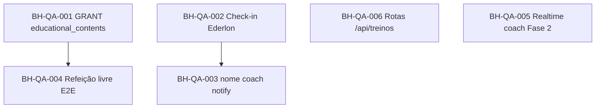

# Backlog QA E2E — Black House

**Data:** 2026-06-07  
**Ambiente:** produção (`https://blackhouse.app.br`, `https://api.blackhouse.app.br`)  
**Metodologia:** skills `qa`, `diagnose`, `triage` (Matt Pocock)  
**Cobertura:** smoke API autenticado (coach Romulo + aluno Pedro Henrique Martins) + rotas públicas + checks BD + Socket.io  

**Resultado bruto:** `docs/arquivo/2026-06-07-qa-e2e-resultado.json`

---

## Resumo executivo

| Severidade | Qtd | Estado |
|------------|-----|--------|
| **P0 — bloqueante** | 2 | Abrir sprint imediato |
| **P1 — alto** | 4 | Próxima semana |
| **P2 — médio** | 3 | Backlog |
| **OK / observação** | 20+ fluxos | Operacionais |

**Fluxos validados com sucesso (API):** login JWT, lista alunos, check-ins pendentes, vídeos, conversas/mensagens coach, notificações, dieta/treino via `/rest/v1`, resumo **Hoje** (`/api/alunos/me/hoje`), Socket.io handshake aluno, upload autenticado (não retorna 401).

---

## P0 — Bloqueantes

### BH-QA-001 · Biblioteca de Conteúdos Educativo quebra para o coach

**O que aconteceu**  
No painel coach, a tab **Biblioteca de Conteúdos Educativo** falha ao carregar. A API responde erro 500.

**O que esperávamos**  
Lista de PDFs/artigos/vídeos do coach, com criar/editar/desactivar.

**Passos para reproduzir**
1. Entrar como coach (ex.: Romulo).
2. Abrir `?tab=educational-contents`.
3. Observar toast/erro ou lista vazia com falha de rede.

**Causa provável (investigação)**  
Utilizador `app_user` da API **não tem permissão SELECT** na tabela `educational_contents` (migration `20260530` criou a tabela sem `GRANT`).

**Status:** ✅ Corrigido em 2026-06-07 (`GRANT` aplicado como `postgres`; `GET /api/educational-contents` → 200).

---

### BH-QA-002 · Ederlon Barbosa ainda não consegue concluir check-in semanal

**Status:** ⏳ Infra corrigida (erros reais, token upload, nginx 120s); **upload API validado** com token Ederlon (200). Aguarda **reteste manual** no telemóvel dele.

**O que aconteceu**  
Aluno **Ederlon Barbosa** (`ederlonbarbosa@gmail.com`) continua com **0 check-ins** na base de dados após correcções de erro/timeout/nginx.

**O que esperávamos**  
Check-in semanal enviado (peso + ≥2 fotos + questionário), visível para o coach.

**Passos para reproduzir**
1. Login como Ederlon no telemóvel (preferir Wi‑Fi).
2. Portal → Check-in → preencher 4 blocos + fotos → Enviar.
3. Verificar toast (deve mostrar erro real, não genérico) e BD.

**Contexto adicional**
- Tem dieta activa (1).
- Sem registos em `weekly_checkins` nem uploads de foto de progresso nos logs históricos.
- Correcções recentes (mensagem de erro, `getToken()` no upload, timeout nginx 120s) **já em produção** — problema persiste ou não foi retestado.

**Critério de aceite**
- ≥1 check-in na BD para este aluno.
- Fotos em storage de progresso.
- Coach vê check-in na inbox.

---

## P1 — Alto

### BH-QA-003 · Notificação “coach respondeu check-in” não mostra nome do coach

**Status:** ✅ Corrigido em 2026-06-07 (`nome_completo` + `user_id` na query; PM2 restart).

**O que aconteceu**  
Após Fase 1 realtime, a notificação ao aluno pode aparecer sempre como **“Seu coach respondeu…”** em vez do nome real.

**O que esperávamos**  
Texto tipo **“Romulo respondeu seu check-in semanal.”**

**Passos para reproduzir**
1. Coach responde check-in de um aluno com portal aberto.
2. Ver toast / notificação no aluno.

**Causa provável**  
Query de notificação usa coluna `coach_profiles.nome`, que **não existe** (coluna correcta: `nome_completo`). Erro SQL é engolido; cai no fallback.

**Critério de aceite**  
Notificação inclui nome do coach quando disponível em `nome_completo`.

---

### BH-QA-004 · Refeição Livre + conteúdo educativo (fluxo aluno)

**Status:** ✅ Validado E2E em 2026-06-07 (coach do aluno cria conteúdo → PATCH dieta → aluno `GET /:id` → 200). Bloqueado anteriormente por BH-QA-001.

**O que aconteceu**  
Aluno só acede conteúdo educativo via `GET /api/educational-contents/:id` quando a dieta tem `refeicao_livre_ativa` + `refeicao_livre_content_id`. Amostra testada (Pedro) tinha refeição livre **desactivada**.

**O que esperávamos**  
Coach activa refeição livre + escolhe conteúdo → aluno vê card/link na **Minha dieta**.

**Passos para reproduzir**
1. Corrigir BH-QA-001 (coach consegue gerir biblioteca).
2. Coach edita dieta → activar Refeição Livre + seleccionar PDF/artigo.
3. Aluno abre tab Dieta → ver secção refeição livre → abrir guia.

**Critério de aceite**  
Fluxo completo coach → aluno sem 403/500.

---

### BH-QA-005 · Realtime só no portal do aluno (coach continua em polling)

**Estado:** ✅ **Resolvido** (2026-06-07) — Fase 2 realtime coach.

**Entrega**
- `useCoachPortalRealtime` + fix auth Socket.io + `new_weekly_checkin` em `notifyUser`
- Inbox e sidebar actualizam via eventos `blackhouse:coach-realtime` / `blackhouse:checkin-pending-updated`

**Reteste sugerido**
1. Aluno envia check-in; coach com inbox aberta.
2. Confirmar toast + badge + lista sem F5 (< 2s com socket ligado).

---

### BH-QA-005 (histórico) · Realtime só no portal do aluno (coach continua em polling)

**O que aconteceu (antes do fix)**  
Fase 1 entregue: aluno recebe toast + refresh em check-in respondido e dieta actualizada. **Coach** ainda depende de polling (~30s) na inbox de check-ins e sidebar.

**O que esperávamos (roadmap)**  
Coach vê novo check-in / resposta pendente quase em tempo real.

**Passos para reproduzir**
1. Aluno envia check-in; coach com inbox aberta.
2. Medir atraso até badge/contador actualizar sem F5.

**Nota**  
Enhancement planeado (Fase 2), não regressão — registado para priorização.

---

### BH-QA-006 · Rota `/api/treinos` inexistente no servidor (só via mapeamento legacy)

**Estado:** ✅ **Resolvido** (2026-06-07) — CRUD semântico em `server/routes/api.js`.

---

### BH-QA-006 (histórico) · Rota `/api/treinos` inexistente no servidor (só via mapeamento legacy)

**O que aconteceu (antes do fix)**  
Chamada directa `GET /api/treinos` → **404**. O frontend funciona porque `apiClient` redirecciona para `/rest/v1/treinos`.

**O que esperávamos**  
Contrato `API_CONTRACT` alinhado com Express (rota semântica real ou documentação clara).

**Impacto**  
Integrações externas, scripts QA e futuros clientes quebrem; dívida técnica pós-purge Supabase.

**Critério de aceite**  
Implementar rotas semânticas `/api/treinos` **ou** remover do contrato e migrar componentes off `/rest/v1`.

---

## P2 — Médio

### BH-QA-007 · Overlay “Modo Seguro” na árvore de acessibilidade

**O que aconteceu**  
Em `/auth`, leitores de ecrã ainda anunciam **“Sistema em Modo Seguro”** embora o overlay esteja visualmente oculto (`#failsafe-ui.hidden`).

**O que esperávamos**  
Fail-safe só perceptível se React não montar.

**Critério de aceite**  
Após mount, remover do DOM ou `aria-hidden="true"` + `display:none`.

---

### BH-QA-008 · Contas de teste com e-mail não confirmado

**O que aconteceu**  
`teste@teste.com` com senha válida recebe **403** “Confirme seu e-mail…” — impede QA manual rápido.

**Sugestão**  
Conta `qa+*@blackhouse.app.br` com e-mail confirmado e aluno vinculado, **ou** documentar credenciais QA em local seguro (não no repo).

---

### BH-QA-009 · Dívida `/rest/v1/*` para CRUD core

**Observação**  
Dieta, treinos atribuídos, avisos destinatários, etc. ainda passam por `/rest/v1` via `apiClient`. Funciona, mas contradiz arquitectura “só `/api/*`”.

**Acção**  
Plano de migração incremental (já referido em `docs/ARQUITETURA-ATUAL.md`).

---

## Matriz de testes E2E (executados)

### Coach (API + rotas UI mapeadas)

| Área | Tab / rota | API smoke | UI browser |
|------|------------|-----------|------------|
| Dashboard | `?tab=dashboard` | — | Não automatizado (sem credenciais browser) |
| Alunos | `?tab=students` | ✅ `/api/alunos/by-coach` | — |
| Check-ins | `?tab=check-ins` | ✅ count + list | — |
| Vídeos | `?tab=videos` | ✅ | — |
| Biblioteca educativa | `?tab=educational-contents` | ❌ 500 | — |
| Treinos | `?tab=workouts` | ✅ via `/rest/v1/treinos` | — |
| Mensagens | `?tab=messages` | ✅ `/api/conversas` | — |
| Notificações | header | ✅ | — |

### Aluno (API + rotas UI mapeadas)

| Área | Tab | API smoke | UI browser |
|------|-----|-----------|------------|
| Hoje | `tab=hoje` | ✅ `/api/alunos/me/hoje` | — |
| Dieta | `tab=diet` | ✅ `/rest/v1/dietas` | — |
| Treino | `tab=workouts` | ✅ `/rest/v1/alunos_treinos` | — |
| Check-in | `tab=checkin` | ✅ list; envio Ederlon ❌ | — |
| Coach (chat) | `tab=coach` | ✅ `/api/mensagens` | — |
| Coach (avisos) | `tab=coach&coachView=avisos` | ✅ via `/rest/v1/avisos_destinatarios` | — |
| Vídeos | `tab=videos` | ✅ | — |
| Progresso | `tab=progress` | — | — |
| Realtime Fase 1 | Socket | ✅ handshake | Pendente teste manual coach→aluno |

---

## Ordem sugerida de tratamento

1. **BH-QA-001** — migration `GRANT SELECT, INSERT, UPDATE, DELETE ON educational_contents TO app_user` (+ rerun migrate).
2. **BH-QA-002** — pedir reteste Ederlon; se falhar, capturar toast exacto + logs nginx/API.
3. **BH-QA-003** — one-line fix `nome_completo` na notificação.
4. **BH-QA-004** — teste E2E refeição livre após #1.
5. **BH-QA-005** — Fase 2 roadmap.
6. Restante P2 quando houver capacidade.

---

## Próxima sessão QA recomendada

- [ ] Teste manual browser coach + aluno lado a lado (resposta check-in → toast aluno).
- [ ] Mobile real (iOS/Android) upload 2 fotos check-in.
- [ ] Regressão importação PDF ficha + dieta.
- [ ] Conta QA dedicada documentada fora do repo.

**Script reutilizável:** `scripts/qa-e2e-smoke.mjs` (requere deps do `server/`).
